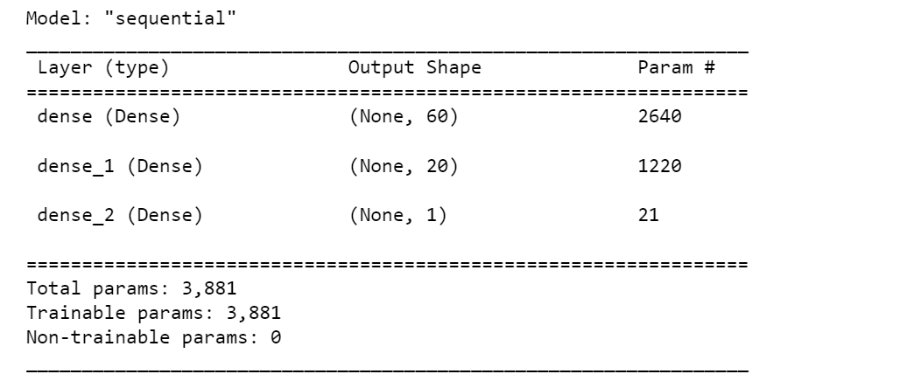
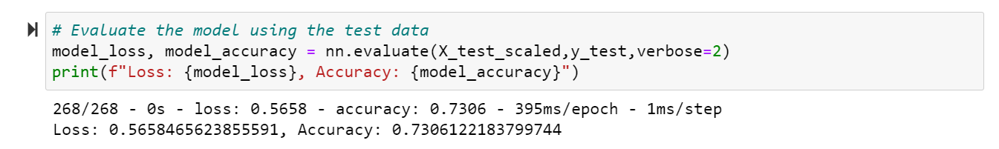

# Neural Network Charity Analysis

## Overview
The purpose of this project is to create a binary classifier that can predict whether or not a organization will be successful if funded by a charity foundation, Alphabet Soup. It uses trains and tests a neural network model for this purpose.

## Results

### Data Preprocessing

- Target Variable: The target variable is the boolean variable "IS_SUCCESSFUL", denoting if the organization succesfully used loan money effectively.
- Feature Variables: The following variables are model features: 
    - APPLICATION_TYPE—Alphabet Soup application type
    - AFFILIATION—Affiliated sector of industry
    - CLASSIFICATION—Government organization classification
    - USE_CASE—Use case for funding
    - ORGANIZATION—Organization type
    - STATUS—Active status
    - INCOME_AMT—Income classification
    - SPECIAL_CONSIDERATIONS—Special consideration for application
    - ASK_AMT—Funding amount requested
- Neither Targets nor Features: The following variables are for identification, and had to be removed before modeling
    - EIN
    - NAME

### Compiling, Training, and Evaluating the Model

- For original model, I selected the following parameters:
    - Hidden layer 1: 60 neurons (similar to number of input variables after hot encoding), relu activation function because it fast, simple, and avoids back-propagation errors
    - Hidden layer 2: 20 neurons (less than half the number from the previous layer), relu activation function because it is fast, simple, and avoids back-propagation errors
    - Output layer: 1 neuron because we are creating a binary classifier, sigmoid activition function because we are creating a binary classifier

- I was able to reach model accuracy of 73.0%, below the target of the 75%.

- Optimization:
    - In optimization attempt 1, I created more bins for rare occurrences in the application_type "variable", lowering the cut off to 100. I also removed the noisy variable "status".
    - In optimization attempt 2, I increased the number of nodes for hidden layer 1 to 100, and for hidden layer 2 to 50.
    - In optimization attempt 3, I added an additional hidden layer with 50 nodes.

## Summary

The neural network / deep learning model I trained was able to predict the success (effective use of money) of previous loans made to organizations by Alphabet Soup to an accuracy of 73%, below the target accuracy of 75%. Multiple attempts were made to optimize the model, but accuracy changed very little.

In this situation, I would suggest using a simpler random forest classifier or XGBoost model. These models have the advantage of being simple to tune, have built in feature selection, and can work well for noisy datasets. 